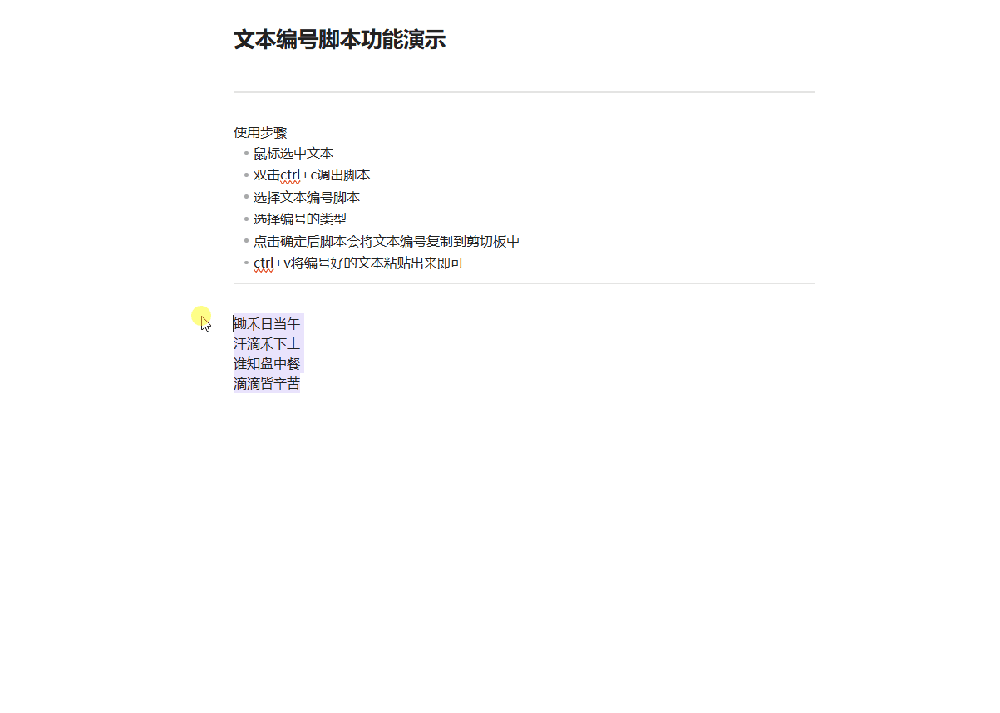

# 文本编号

> 为选中的分段文本自动添加编号，结果复制到剪贴板

## 1. 简介

编辑文档时，经常需要给多行文本添加序号。本脚本可以自动为选中的文本编号，支持 **14 种编号格式**（数字、字母、罗马数字、中文数字等），编号完成后自动复制到剪贴板，手动粘贴即可。

- 选中文本后一键编号，无需手动输入序号
- 支持 14 种编号格式，覆盖常见排版需求
- 编号完成自动替换编辑器中的选中文本，也可勾选关闭、仅复制到剪贴板
- 空行保留占位，编号只作用于非空行
- 小巧轻量，通过不忙脚本盒子即可使用

## 2. 示例

选中多行文本 → 双击 Ctrl+C 触发 → 选择编号格式 → 粘贴结果

## 3. 快速开始

- **自动安装（推荐）**
  
  - 下载[不忙脚本盒子](https://www.bm-box.cn)后，打开 → 脚本市场 → 搜索「文本编号」→ 点击安装。
  - 盒子会自动配置 AutoHotkey v2 环境，安装后选中文本双击 Ctrl+C 即可使用。

- **手动安装**
  
  - 需自行安装 AutoHotkey v2，在脚本目录执行 `AutoHotkey64.exe main.ahk`。

## 4. 启动方式（通过盒子部署）

- **快速复制启动** — 在任意文档中选中要编号的多行文本，快速双击 Ctrl+C（不忙脚本盒子的超级复制功能），弹出编号格式选择窗口，选择格式后自动替换掉编辑器中的选中文本（可在弹窗中取消勾选，改为仅复制到剪贴板）。
- **单击启动** — 打开不忙脚本盒子，在已安装脚本列表找到「文本编号」，单击即可运行。

## 5. 全部功能一览

| 功能    | 说明                          |
| ----- | --------------------------- |
| 纯数字   | 1, 2, 3                     |
| 前导零   | 01, 02, 03                  |
| 半角括号  | (1), (2), (3)               |
| 全角括号  | （1）, （2）, （3）               |
| 方括号   | [1], [2], [3]               |
| 空心括号  | 【1】, 【2】, 【3】               |
| 数字加点  | 1., 2., 3.                  |
| 小写字母  | a, b, c（限 26 行内）            |
| 大写字母  | A, B, C（限 26 行内）            |
| 带圈数字  | ①, ②, ③（限 20 行内）            |
| 小写罗马  | i, ii, iii                  |
| 大写罗马  | I, II, III                  |
| 中文小写  | 一, 二, 三                     |
| 中文大写  | 壹, 贰, 叁                     |
| 自动剪贴板 | 编号完成自动复制到系统剪贴板              |
| 自动替换  | 编号完成后自动粘贴替换编辑器中的选中文本（可勾选关闭） |
| 完成提示  | 通过盒子气泡显示处理结果                |

## 6. 更新日志

- v1.2.0（当前最新版）
  
  - 编号完成后自动替换编辑器中的选中文本，无需手动粘贴（弹窗中可勾选关闭）
  - 空数据、处理成功等提示改用盒子桌面气泡通知
  - 按处理结果区分提示文案（已替换 / 已复制）

- v1.1.0
  
  - 引入 JSON.ahk 库替换手写 JSON 解析，解析更稳定可靠
  - 格式选择界面改为两列布局，小屏幕不再溢出
  - 移除无效的 JSON 输出，运行更干净

- v1.0.0
  
  - 首次发布
  - 支持 14 种编号格式
  - 通过超级复制触发
  - 结果复制到剪贴板

*
